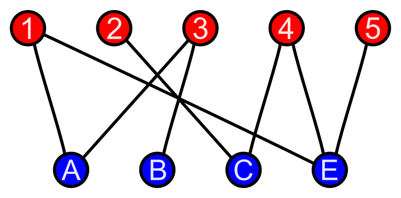

+++
title = "Hall's Marriage Theorem"
date = 2024-10-15T19:44:34+08:00
draft = true
+++

首先, 為了方便說明 Hall's marriage theorem ,我需要先介紹一些名詞定義: 二部圖 (bipartite graph), 配對 (matching), M-saturated, M-交錯路徑 (M-alternating path) 和 M-增廣路徑 (M-augmenting path)

## 二部圖 (Bipartite Graph)

一個圖 G 的頂點集合可以分成兩堆 V1, V2, 並且滿足 G 的所有邊的兩個端點一個在 V1, 另一個在 V2 (也就是 V1 和 V2 內部沒有任何邊), 則稱 G 是一個二部圖

二部圖有一個有趣的性質 (也可以用來定義): 可以每個頂點用兩種不同顏色塗色, 並且相鄰頂點顏色不同

## 配對/配對 (Matching)

matching 是一組邊的集合 (M ⊆ E(G)), 滿足兩個條件:

1. 沒有頂點被重複選到
2. 所有邊都不是圈 (一定要兩個不同的頂點)

需要注意的是 matching 並沒有保證要選到所有點, 包含所有點的 matching 我們會稱作 perfect matching

顯然, 頂點數為奇數的圖一定沒有 perfect matching (至少有一個點會剩下來)

## M-saturated, M-unsaturated

matching 是邊的集合, 而 M-saturated 和 M-unsaturated 則是描述頂點的形容詞

一個 matching M 當中的頂點我們會稱它是 M-saturated 的頂點

反之, 不在 matching 中的頂點我們稱它為 M-unsaturated 的頂點

## M-交錯路徑 (M-alternating Path)

對於圖 G, 給定一個 matching M 和一條路徑 P

如果 P 的所有邊交替出現在 M 和不在 M 中, 則稱 P 為 M-交錯路徑

## M-增廣路徑 (M-augmenting Path)

M-增廣路徑是 M-交錯路徑的一種 (更嚴格)

如果 P 是 M-交錯路徑, 並且 P 的起點和終點都不在 M 的頂點集合中, 稱 P 為 M-增廣路徑

## 定理內容

Let G be a bipartite graph with sets X and Y.

Then G has a matching of A which saturate X iff |N(S)| >= |S| for all S ⊆ X.

X,Y-二部圖有 saturate X 的配對「若且唯若」對任意 S ⊆ X 都有 |N(S)| >= |S|

N(S) 指的是對所有 S 的頂點, 它在 G 中的所有鄰居全部算進來組成的頂點集合

## 證明 (🠲)

假設 M 是 saturate X 的 matching

則對於 X 的所有頂點 v, 都可以透過 M 找到 Y 中唯一對應的頂點 u

除此之外 v 可能在 Y 還有其他鄰居頂點 (也可以都沒有表示一一對應, 此時 |N(S)| = |S|)

因此 |N(S)| >= |S|

## 證明 (🠰) - 使用反證法

我們要證明: X,Y-二部圖沒有 saturate X 的 matching, 則存在 S ⊆ X 使得 |N(S)| < |S|

假設 M 是一個 maximum matching, 但是 unsaturate X

代表 X - {所有 M-saturated 的頂點} 不是空集合

假設 u ∈ X - {所有 M-saturated 的頂點}

假設 S 是 u 出發的 M-交錯路徑在 X 這半邊的頂點所構成的集合, T 是 u 出發的 M-交錯路徑在 Y 半邊頂點所構成的集合

因為 M 已經是 maximum matching, 所以不存在 u 出發的增廣路徑

所以每個 T 中的頂點都可以透過 M 對應到唯一一個在 S 的頂點, T = N(S)

並且 |T| = |S - {u}|

因此 |N(S)| < |S|
