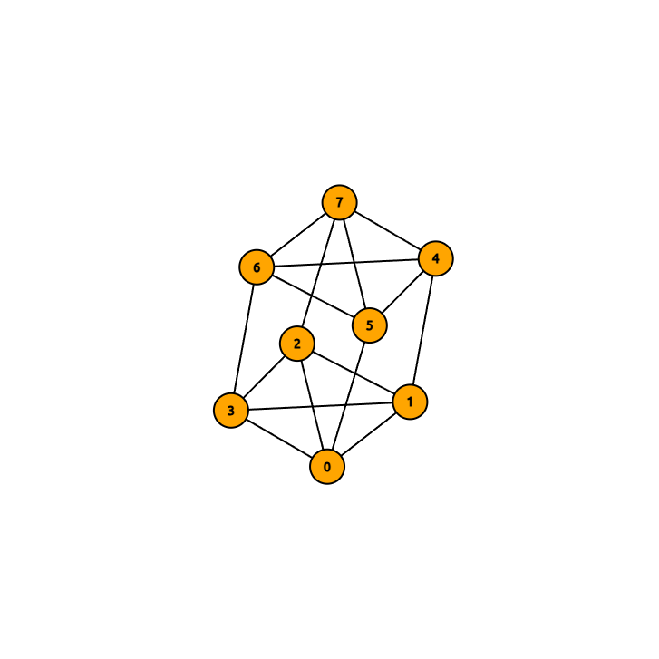
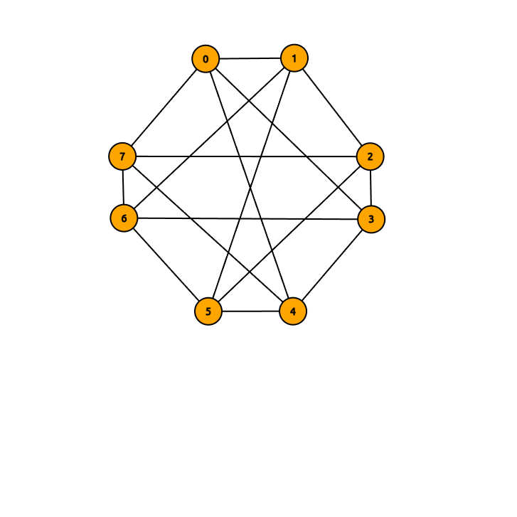
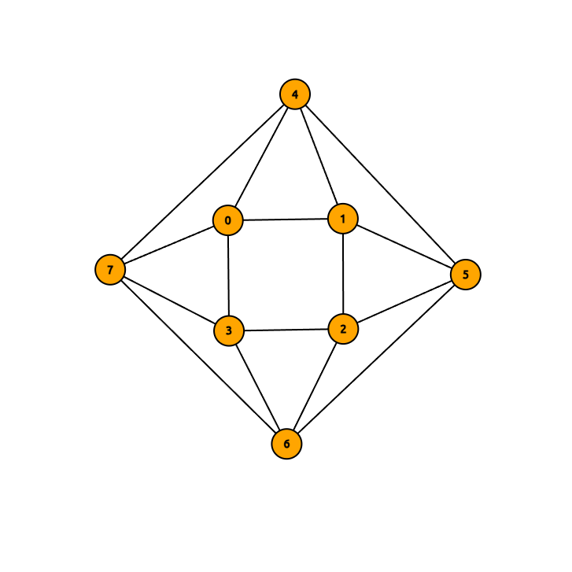
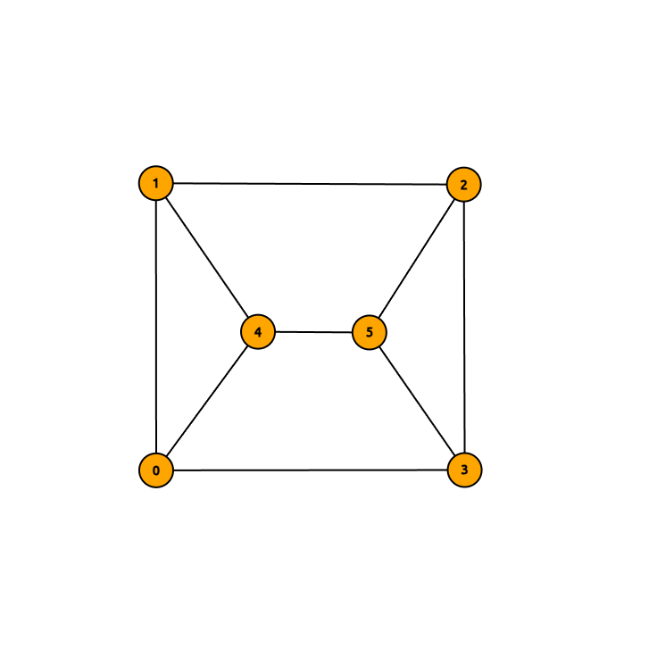
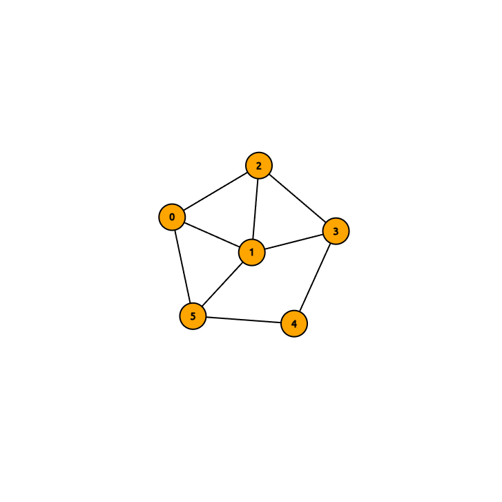

+++
title = '圖論'
date = 2024-10-15T16:05:35+08:00
draft = true
+++

## 若 |E(G)| = m, 則 G 共有多少個生成子圖?

生成子圖 (spanning subgraph): 具有相同頂點集合的子圖 (頂點不能少)

我們只需要考慮對原圖 G 的每條邊要不要拿取

因此生成子圖的數量為 2^m

## 請給出三個兩兩 (彼此) 不同構的總點數為 8 且 4-正則的圖, 並給出互相不同構的理由

## 若 T 是總點數為 211 的樹, 每個頂點的度是 1, 2, 3 或 5. 假設度為 1 的頂點共 70 個且度為 3 的頂點共 11 個, 則度為 5 的頂點有多少個?

樹有一個很重要的性質: |E(T)| = |V(T)| - 1

此外, 一條邊會貢獻兩個 degree, 所以 total degree = 2 *|E(T)| = 2* 210 = 420

- degree 為 1 的點就是葉子節點 (leaf)
- degree 為 2 的點有 1 個小孩
- degree 為 3 的點有 2 個小孩
- degree 為 5 的點有 4 個小孩

假設 degree 為 2 的點有 x 個, degree 為 5 的有 y 個

total degree = 所有 degree 相加 = 1 *70 + 3* 11 + 2 *x + 5* y = 420

2x + 5y = 317

## G 是一個共 n 個頂點的 k-regular 簡單圖, k 至少需要多大才能保證它是連通圖?

k = floor(n / 2)

還不確定, 等等算

## 證明一群人中至少存在兩位的 (在這群人中的) 朋友數目相同

假設有 n 個人

每個人的朋友數目範圍是 [0, n-1] 共有 n 種可能

但是如果有一個人的朋友數是 n-1 代表它和其他所有人都是朋友, 也就表示其他所有人都至少有 1 個朋友, 因此不存在朋友數為 0 的人

反之, 如果有人的朋友數是 0, 則不存在朋友數是 n-1 的人

因此每個人的朋友數只有 n-1 種可能

總共 n 個人, 卻只有 n-1 種可能, 因此至少有兩個人的朋友數相同

## 證明: 如果 G 是頂點數目大於 3 的連通圖, 並且 G 只有 1 個環, 則 |E(G)| = |V(G)|

樹是沒有環的連通圖

樹的邊樹 = |V(G)| - 1

加上一個環表示邊數多 1, 所以 |E(G)| = |V(G)| - 1 + 1 = |V(G)|

## 求下圖的 α, β, α', β' 和對應的 vertex/edge 集合

- α: 最大 independent set 大小
- β: 最小 vertex cover (點覆蓋邊) 大小
- α': 最小 edge cover (邊覆蓋點) 大小
- β': 最大 matching 大小

α, β 和頂點 (vertex) 有關

α', β' 和邊 (edge) 有關

以這題來說

- α = 2
- β = 4
- α' = 3
- β' = 3

### 3 個重要定理

- α + β = n
- 如果 G 沒有孤立點 (δ(G) >= 1), 則  α'+ β' = n
- 二部圖且沒有孤立點, 則 α = β'

## 求下圖的連通度

連通度 (connectivity): S 是某個頂點集合使得 G - S 不連通, S 大小的最小值稱為連通度, 記作 κ(G)

只刪除任意一個點, 圖依然保持連通

刪除 3 和 5 後, 圖變成不連通

因此, κ(G) = 2

## 若 G 是 k-連通圖, H 是對 G 加上 1 個頂點 y 並讓 y 和 G 任意 k 個頂點相鄰所得到的圖, 請證明 H 是 k-連通圖

k-連通 (k-connected): 從圖中移除任意少於 k 個頂點後仍然是連通圖

例如一個圖是 4-連通, 代表從這個圖任意移除 1, 2, 3 個點圖依然保證連通

假設 S 是 H 的頂點集合子集, 並且 S 的頂點數目少於 k (也就是 |S| < k)

我們分成兩個狀況討論: y 在 S 集合 和 y 不在 S 集合

### y 在 S 集合

顯然 S - {y} 會是原圖 G 的頂點集合子集, 並且 H - S 會和 G - (S - {y}) 同構

既然 G 是 k-連通圖, 所以任意刪除少於 k 個點後的 G 依然會是連通圖, 因此 G - (S - {y}) 是連通圖

因此, H - S 是連通圖

### y 不在 S 集合

顯然 S 是原圖 G 的頂點集合子集

因為 G 是 k-連通圖, 所以 G - S 是連通圖

因為 |S| < k, 所以 S 最多有 k - 1 個頂點

既然 y 和 G 的其中 k 個頂點相連, 因此和 y 相連的頂點至少有 1 個不在 S 裡面, 假設其中一個不在 S 且和 y 相鄰的點為 x

所以 H - S 的 y 依然可以透過 x 連通

因此 H - S 是連通圖

## 若 G 是 n 個頂點的連通圖 (n >= 3), 並且從 G 刪除任意一個頂點後的圖都是一個樹, 請證明 G 同構 Cn

G 是連通圖, 所以 G 的分支 (component) 數是 1

樹 (tree): 沒有環 (acyclic) 的連通 (connected) 圖

G 是連通圖, 所以 G 不可能有 degree 為 0 的點

G 是連通圖並且 n >= 3, 所以 G 不可能有 degree 為 1 的點

因此, G 的所有點的 degree >= 2
