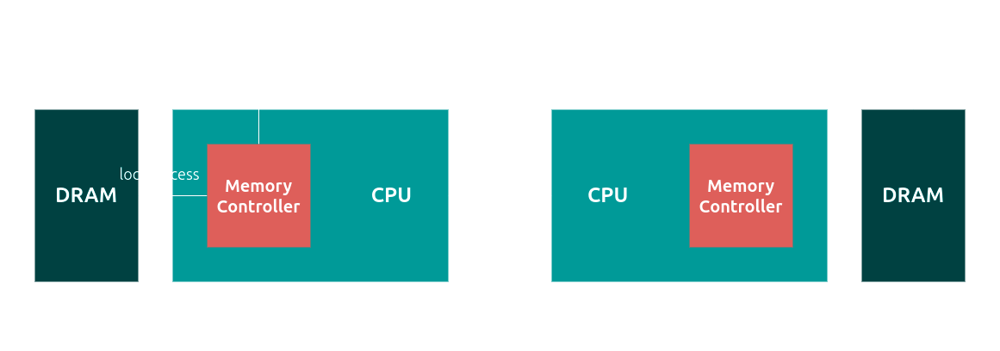

+++
title = '作業系統 - 記憶體管理'
date = 2024-10-19T20:16:56+08:00
draft = false
tags = ['Operating System']
+++

## Physical Memory Management

Linux 對於物理記憶體, 分成了多層的資料結構來管理, 從上而下分別是 node, zone, page frame, 特別注意, Linux 核心程式中 page 這個 struct 指的是 (page) frame 而不是 virtual memory page

區分 node 的原因是對於 NUMA 架構, local access 存取速度較於 remote access 還要快



而在 zone 的部份, 對於 x86 32-bit 系統, 分成 3 個:

- `ZONE_DMA`: 0 - 16 MB
- `ZONE_NORMAL`: 16 MB - 896 MB
- `ZONE_HIGHMEM`: 896 MB - 4 GB

DMA (direct memory access) 是指裝置之間傳輸資料不須 CPU 的參與, 例如硬碟, 網路卡能夠直接從 main memory 存取資料, 好處是可以節省 CPU time

一般情況下, kernel 使用 `ZONE_NORMAL`, static (direct) mapping

當 kernel (虛擬記憶體最多 1GB) 需要超過 896 MB 的記憶體時, 就必須用到 `ZONE_HIGHMEM` (dynamic mapping)

不過對於 x86 64-bit 的系統, 因為虛擬記憶體不再受限 4GB 的大小, 所以所有的實體 (物理) 記憶體都能夠使用 direct mapping, 因此不再區分出 `ZONE_HIGHMEM`

### Buddy System

## Virtual Memory Management

### Segmentation

### Paging

x86 提供了 segmentation 和 paging 兩種機制, 但是實際上 Linux 主要使用的是 paging

除此之外, Linux 使用 multi-level paging

為什麼要用 multi-level? 因為要讓 page table 的大小不要過大

如果沒有 multi-level, 對於使用 4 KB page size, 48-bit (virtual) address space (也就是我們常用的 x86_64), 8-Byte PTE (page table entry), 我們需要一個大小為 2^(48 - 12) * 8 = 2^39 = 5 GB 大小的 page table, 這顯然是不切實際的設計


所以我們可以改成使用 multi-level paging, 這樣雖然 page table 全部加起來的大小不會改變, 但是我們可以把除了 top level (level 1) 以外的 page table 不要一開始就建立 (真的有使用到時再分配記憶體), 還可以在沒使用的時候把它 swap 到 disk


```text
48 = 9 + 9 + 9 + 9 + 12

---------------------------------------------------------------------------------------------------------
|      9 bits       |      9 bits       |      9 bits       |      9 bits       |        12 bits        |
---------------------------------------------------------------------------------------------------------
|    PGD Offset     |    PUD Offset     |    PMD Offset     | Page Table Offset |   Page Offset (4KB)   |
---------------------------------------------------------------------------------------------------------
```

那為什麼選擇 4 level 而不是更少/更多呢?

我們希望讓一個 page table 的大小不要超過一個 page, 這樣就只需要一個 register 紀錄 base address

因為 512 (# of PTE) * 8 (PTE size) = 4 KB

所以選擇一個 page table 有 512 個 entry, 換言之, page table offset 要是 9 bits (因為 2^9 = 512)

## 題目

### 一個 2-level page table, TLB hit ratio = 85%, 求 effective memory acctime 和 memory access time 的比例

TLB hit -> access time = 1
TLB miss -> access time = 3 (先查 top-level, 再查 2nd-level, 最後才真正 access 目標)

所以 effective memoery access time = 0.85 x 1 + 0.15 x 3 = 1.3
