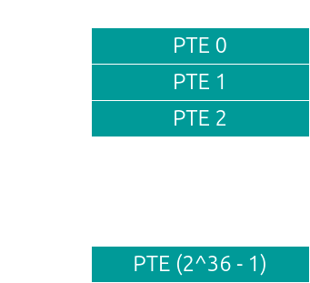
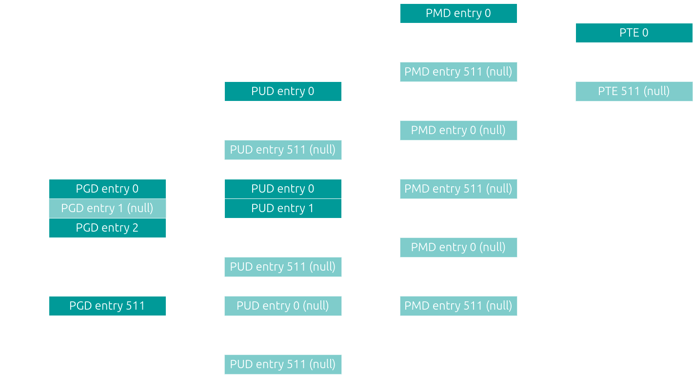

+++
title = '作業系統 - 記憶體管理'
date = 2024-10-19T20:16:56+08:00
draft = false
tags = ['Operating System']
+++

## Segmentation

## Paging

## Linux

x86 提供了 segmentation 和 paging 兩種機制, 但是實際上 Linux 主要使用的是 paging

### multi-level

為什麼要用 multi-level? 因為要讓 page table 的大小不要過大

如果沒有 multi-level, 對於使用 4 KB page size, 48-bit (virtual) address space (也就是我們常用的 x86_64), 8-Byte PTE (page table entry), 我們需要一個大小為 2^(48 - 12) * 8 = 2^39 = 5 GB 大小的 page table, 這顯然是不切實際的設計



所以我們可以改成使用 multi-level paging, 這樣雖然 page table 全部加起來的大小不會改變, 但是我們可以把除了 top level (level 1) 以外的 page table 不要一開始就建立 (真的有使用到時再分配記憶體), 還可以在沒使用的時候把它 swap 到 disk



```text
48 = 9 + 9 + 9 + 9 + 12

---------------------------------------------------------------------------------------------------------
|      9 bits       |      9 bits       |      9 bits       |      9 bits       |        12 bits        |
---------------------------------------------------------------------------------------------------------
|    PGD Offset     |    PUD Offset     |    PMD Offset     | Page Table Offset |   Page Offset (4KB)   |
---------------------------------------------------------------------------------------------------------
```

那為什麼選擇 4 level 而不是更少/更多呢?

我們希望讓一個 page table 的大小不要超過一個 page, 這樣就只需要一個 register 紀錄 base address

因為 512 (# of PTE) * 8 (PTE size) = 4 KB

所以選擇一個 page table 有 512 個 entry, 換言之, page table offset 要是 9 bits (因為 2^9 = 512)
